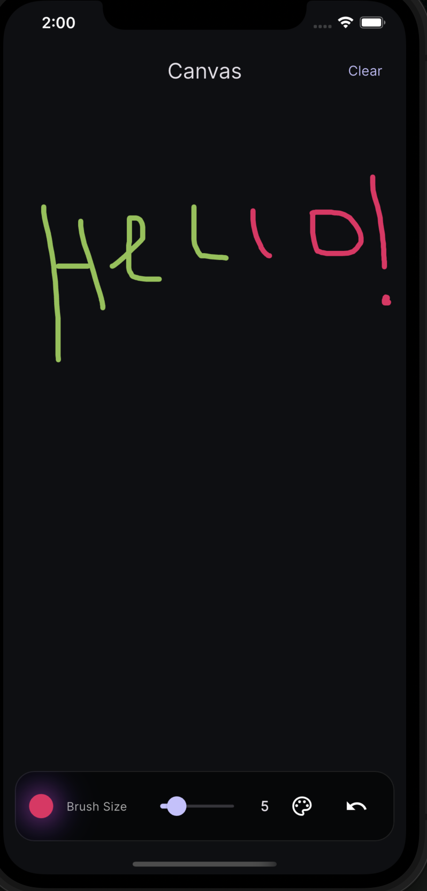

# 🎨 Premium Canvas


> **Premium Canvas** — a modern Flutter-based drawing app that lets you unleash your creativity with smooth brush strokes, a beautiful color picker, and an intuitive interface.

---

## ✨ Features

✅ **Free Drawing** — Draw smoothly on a customizable canvas  
🎨 **Color Picker** — Choose any color or select from recent ones  
📏 **Brush Size Control** — Adjust brush size with precision  
🔄 **Undo & Clear** — Undo strokes or clear the entire canvas  
🌙 **Dark Mode UI** — Sleek, modern, and optimized for AMOLED  
💾 **Recent Colors** — Saves your last-used colors automatically

---

## 📸 Screenshots

| Drawing Canvas | Color Picker | Brush Preview |
|--------------|--------------|---------------|
|  | *(Add Screenshot)* | *(Add Screenshot)* |

---

## 🛠️ Tech Stack

| Technology         | Purpose                                |
|--------------------|---------------------------------------|
| **Flutter**        | Cross-platform UI toolkit             |
| **Riverpod**       | State management                      |
| **Google Fonts**   | Clean, modern typography              |
| **Flutter Color Picker** | Pick and manage colors             |
| **Animations**     | Smooth transitions and effects        |

---

## 📂 Project Structure

```
lib/
├── core/
│   ├── constants/
│   │   ├── app_colors.dart      # App color palette
│   │   └── app_sizes.dart       # Global sizes & paddings
│   └── theme/
│       └── app_theme.dart       # Centralized app theming
│
├── features/drawing/
│   ├── data/models/
│   │   ├── brush_model.dart     # Brush data model (color & size)
│   │   └── stroke_model.dart    # Stroke data model (points, color, size)
│   │
│   ├── painter/
│   │   └── drawing_painter.dart # CustomPainter for drawing strokes
│   │
│   ├── view/
│   │   ├── widgets/
│   │   │   ├── brush_preview.dart      # Brush size preview with animation
│   │   │   ├── color_picker_sheet.dart # Bottom sheet for picking colors
│   │   │   ├── control_toolbar.dart    # Toolbar with brush controls & actions
│   │   │   └── drawing_screen.dart     # Main drawing screen
│   │   └── viewmodel/
│   │       └── drawing_viewmodel.dart  # State management using Riverpod
│
└── main.dart                   # App entry point
```

---

## ⚡ Getting Started

### 1️⃣ Clone the repository

```bash
git clone https://github.com/hoziercode/Drawing-App.git
cd Drawing-App
```

### 2️⃣ Install dependencies

```bash
flutter pub get
```

### 3️⃣ Run the app

```bash
flutter run
```

---

## 🧠 How It Works

- **State Management** — Handled via **Riverpod** for managing brush color, size, strokes, and recent colors  
- **Drawing Engine** — Uses `CustomPainter` to draw smooth lines and store strokes  
- **Color Picker** — Modal bottom sheet with recent color memory  
- **Brush Controls** — Animated brush preview with intuitive size adjustments

---

## 🚀 Future Enhancements

- ✏️ **Eraser Tool**
- 💾 **Save Drawings as Images**
- 🖼️ **Export to Gallery or Share**
- 📐 **Multiple Canvas Sizes**

---

## 👨‍💻 Author

**Hozier Code**  
Frontend & Flutter Developer 🚀

[](https://damilolahoseasalako.netlify.app/project)  
[](https://www.linkedin.com/in/damilola-salako-9125132a9?utm_source=share&utm_campaign=share_via&utm_content=profile&utm_medium=android_app)  
[](https://x.com/hoziercode?t=azmsTQToJxGvQyVIziHNzQ&s=08)

---

## 📜 License

This project is licensed under the **MIT License** — you are free to use, modify, and distribute it.
